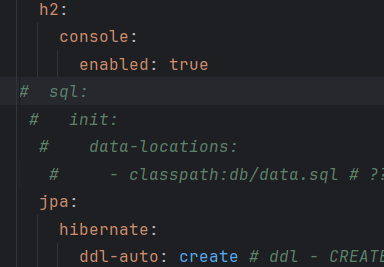

# 프로젝트 1 (팀3)
#### 팀 인원 : 설동훈, 박동기, 김완준, 이소연, 서지민

1. 화면 그리기
   1. 큰 틀
      1. 메인 페이지
      2. 마이 페이지
      3. 게시판
      4. 공고 페이지 
      5. 이력서 페이지
      6. 스크랩 페이지
   2. 메인 페이지와 마이페이지는 User에 구현
2. 기본 컨벤션
   1. 파일명
      1. 자바 (파스칼, BoardController)
      2. 머스태치 (카멜, boardForm)
   2. 변수명 및 id, name 등
      1. 언더바 ("_")
   3. 추가 사항은 소통을 통해 결정
   4. 개인 0, 기업 1

### 더미 데이터 삽입 시 참고 사항
지금은 data.sql가 비어 있어 실행 시 오류를 발생하는데
필요에 따라 주석을 풀고 더미 데이터를 삽입하여 사용하면 된다.

(application.yml 파일)

